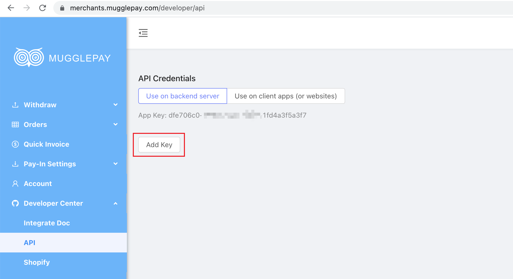

# mugglepay-php-sdk

## Init & Athorization

``` php
$Mugglepay = new Mugglepay($appSecret, $gateWayUrl);
```

## Create Order

``` php
$order_id = $Mugglepay->random(10);
$price = 10.99;
$priceCurrency = 'CNY';
$payCrurrency ='';
$mobile ='';
$title = 'here is the title';
$description = 'here is the description';
$httpxx = ($Mugglepay->isHTTPS() ? 'https://' : 'http://') . $_SERVER['HTTP_HOST'];
$fast = '';

// https://github.com/MugglePay/MugglePay/blob/master/API/order/CreateOrder.md
$data['merchant_order_id'] = $order_id;
$data['price_amount'] = (double)$price;
$data['price_currency'] = $priceCurrency;
$data['pay_currency'] = $payCrurrency;
$data['mobile'] = $mobile;
$data['title'] = $title;
$data['description'] = $description;
$data['callback_url'] = $httpxx . '/callback.php?order_id='. $order_id;
$data['success_url'] = $httpxx . '/success.php?order_id='. $order_id;
$data['cancel_url'] = $httpxx . '/cancel.php?order_id='. $order_id;
$data['fast'] = $fast;
$data = array_filter($data);
// var_dump($data);

$str_to_sign = $Mugglepay->prepareSignId($order_id);
$data['token'] = $Mugglepay->sign($str_to_sign);
$result = json_decode($Mugglepay->mprequest($data), true);
```

## Run example

``` bash
php example.php
```

## How to Register

1. First click on the Sign Up address above
2. Sign In [MugglePay Portal](https://merchants.mugglepay.com/)
3. Choose"Developer Center"->“API”->“Use on backend server”，click“Add Key”，Get ur Key。

4. replace `appSecret` in Config.py with your key
